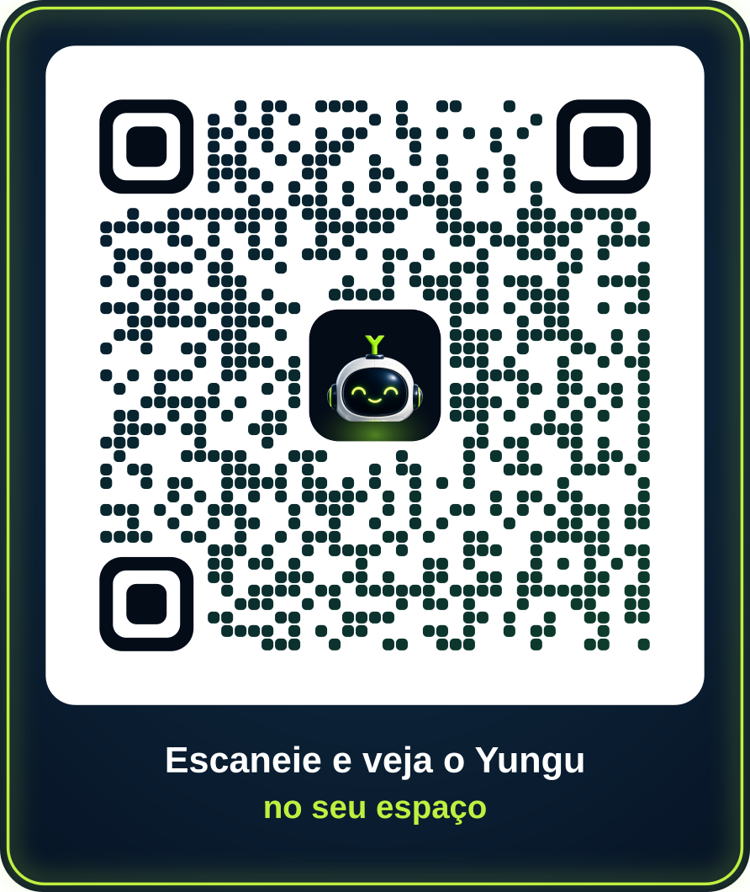

# Yungu Augmented Reality

Web AR experience for the Yungu mascot. No app to install: one QR code opens a website.

| Mode | iPhone / iPad | Android | Desktop |
|---|---|---|---|
| **View in my space** (`index.html`): place Yungu on the floor or a table, hovering | ✅ AR Quick Look | ✅ WebXR / Scene Viewer | 3D viewer + QR to open on a phone |
| **Joystick mode** (`play.html`): drive Yungu around the room | 3D mode (no AR) | ✅ AR with joystick | 3D mode (joystick, WASD, gamepad) |

iPhone Safari doesn't allow web pages to run their own AR session, so on iPhone the joystick mode opens in 3D, and "View in my space" uses Apple's built-in AR viewer.

---

## Quick start

Requires [Node.js](https://nodejs.org) 20 or newer.

```bash
npm install
npm run dev          # http://localhost:5173  (landing)  ·  /play.html  ·  /tools/qr.html
```

On the computer, the 3D joystick mode works right away. Use **WASD / arrow keys** to move and **E / Space** to wave, or plug in a gamepad.

To try AR on a phone, see [docs/TESTING-ON-PHONE.md](docs/TESTING-ON-PHONE.md). AR needs HTTPS.

```bash
npm run build        # static site in dist/  → upload anywhere (see docs/DEPLOY.md)
npm run preview      # serve the built site locally
npm run qr -- https://your-domain.com/yungu   # artistic QR as SVG in qr-code/
```

---

## Project structure

```
yungu-augmented-reality/
├─ index.html                 Landing page: 3D viewer + "Ver no meu espaço" (AR) + link to play mode
├─ play.html                  Joystick mode (WebXR AR on Android, 3D elsewhere)
├─ src/
│  ├─ shared/
│  │  ├─ config.js            ← model paths, size, speed, glow pulse settings
│  │  ├─ strings.js           ← dynamic UI messages (pt-BR)
│  │  ├─ device.js            iPhone / Android / WebXR detection
│  │  └─ base.css             colors, fonts, buttons
│  ├─ landing/                landing page script + styles (uses <model-viewer>)
│  ├─ play/
│  │  ├─ main.js              scene, WebXR session, floor hit-test, tap to place, HUD
│  │  ├─ yungu.js             character: animation, movement, lean, glow pulse
│  │  ├─ joystick.js          touch joystick + keyboard + gamepad
│  │  └─ play.css
│  └─ qr/artistic-qr.js       artistic QR → SVG (used by the tool and the CLI)
├─ public/                    copied as-is to the site
│  ├─ models/
│  │  ├─ yungu.glb            viewer + Android AR (Hover animation)
│  │  ├─ yungu.usdz           iPhone AR Quick Look (Hover animation)
│  │  └─ yungu-play.glb       joystick mode (Hover, Idle, Wave, Blink)
│  ├─ img/                    icons, poster, link-preview image
│  ├─ _headers, .htaccess     MIME types for .usdz / .glb on the server
├─ tools/qr.html              QR generator (dev only, not deployed): preview, PNG/SVG, scan test
├─ scripts/make-qr.mjs        QR generator from the command line
├─ qr-code/                   generated QR artwork goes here
├─ 3d/
│  ├─ source/Yungu.blend      editable model, rig, all animations, glow animation
│  ├─ game-exports/           GLB / FBX for game engines (low and high poly)
│  ├─ textures/               chest screen + glow textures
│  └─ blender-scripts/        Python that rebuilds / re-exports everything
├─ media/                     hover animation videos, renders
└─ docs/                      phone testing, deploy, 3D pipeline
```

---

## Common changes

| I want to… | Edit |
|---|---|
| Change page texts | `index.html`, `play.html` (static text), `src/shared/strings.js` (messages) |
| Make Yungu bigger/smaller in joystick mode | `PLAY.startScale` in `src/shared/config.js` |
| Make him faster / turn quicker | `PLAY.speed`, `PLAY.turn`, `PLAY.accel` |
| Change the light pulse | `PLAY.glow` (base brightness and swing per material) |
| Change colors | `src/shared/base.css` (`--lime`, `--navy`) |
| Change the model's size in "Ver no meu espaço" | re-export with a new scale: [docs/3D-PIPELINE.md](docs/3D-PIPELINE.md) |
| Replace the 3D model | export new files to `public/models/` with the same names |

The model in `public/models/` is **about 59 cm tall**. Visitors can pinch to resize it in AR.

---

## How the joystick mode works

1. `navigator.xr.isSessionSupported('immersive-ar')` decides AR or 3D.
2. AR session with `hit-test` (find the floor), `dom-overlay` (HTML joystick over the camera) and `light-estimation` (Yungu's shading matches the room).
3. A lime ring follows the floor where the phone points, and a tap places Yungu there, facing you.
4. The joystick moves him **relative to where the camera looks**. He turns to face the direction he's moving, leans forward at speed, and tilts into turns.
5. The Hover animation loops. The glow on his eyes, chest, antenna, base and floor light is synced to the bob: brighter when he dips, softer when he rises, and a little brighter while moving.

---

## QR code

- Browser tool: `npm run dev` → `http://localhost:5173/tools/qr.html`. Type the final URL, then download SVG for print or PNG. Each version is scan-tested automatically.
- CLI: `npm run qr -- https://your-domain.com/yungu` (add `--utm` for analytics tracking).
- Error correction H, logo covers less than 9% of the code. In testing, the code read at 90 px, rotated, in perspective, blurred and in dim noisy light.
- Print it at least **2.5 × 2.5 cm**, roughly 1 cm of QR per 10 cm of scanning distance. Keep the white panel. Test on an iPhone and an Android phone before printing.
- Adding UTM tags makes the URL longer, which makes the QR denser (version 4 → 8). Use a short URL.



---

## Ideas for next steps

- Sound (a soft hover hum that follows the bob)
- More buttons: jump, spin, emotes using the Eye/Mouth bones
- Real-world occlusion (WebXR depth sensing on supported Android phones)
- Native app (Unity + AR Foundation) for joystick AR on iPhone, using `3d/game-exports/`
